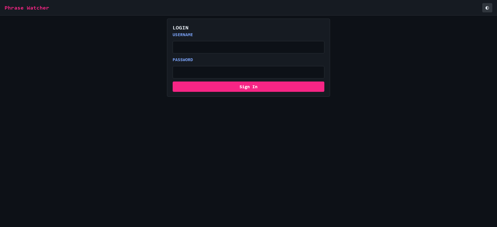
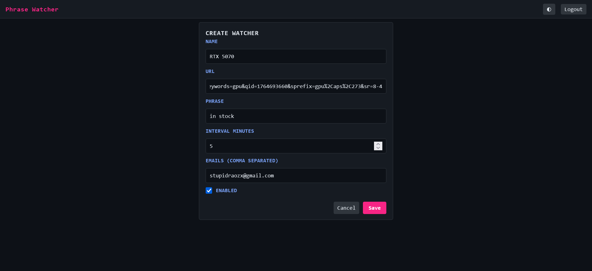
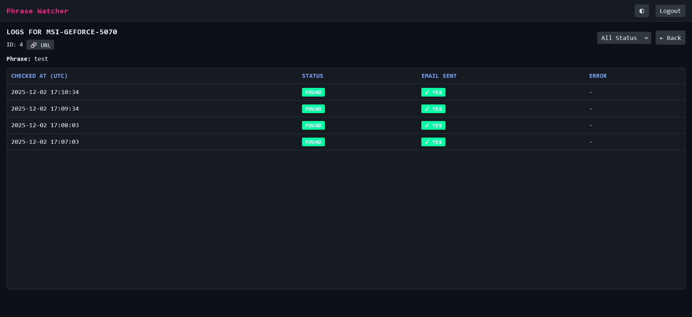

# Watcher — Webpage Phrase Monitor

A FastAPI + APScheduler app that checks webpages on intervals, detects phrases, and sends email alerts. Supports JS-heavy pages using Playwright with stealth + fingerprinting.

📖 **[User Guide](USER_GUIDE.md)** - Step-by-step instructions for using the application

## Features
- Multiple watchers (URL, phrase, interval, recipients)
- Background execution (no blocking HTTP)
- Safe scheduler (no overlapping jobs)
- Static + JS-rendered phrase detection
- Stealth Playwright (navigator masking, fingerprinting)
- Configurable render timeout + post-render delay
- Auto-tuned timeout with hard cap for heavy pages
- Logs per check + simple admin UI
- Email notification tracking - See if alert emails were successfully sent
- Docker + Nginx setup included

## Screenshots

| Login Page | Watcher Dashboard |
|------------|-------------------|
|  |  |

| Watcher Form | Logs Table |
|-------------|------------|
|  |  |

## Quickstart (Docker)
```bash
cp .env.example .env
docker compose up --build
```
Visit http://localhost:8080 and log in.

## Development
```bash
python -m venv .venv
source .venv/bin/activate
pip install -r requirements.txt
uvicorn app.main:app --reload
```

## Key Environment Variables
- Auth: `ADMIN_USERNAME`, `ADMIN_PASSWORD`
- DB: `DATABASE_URL`
- Email: `SMTP_*`, `FROM_EMAIL`
- Scheduler: `WATCH_INTERVAL_SECONDS`, `TIMEZONE`
- Rendering:
  - `RENDER_JS=true`
  - `RENDER_TIMEOUT` (auto-tuned, 30–180s)
  - `RENDER_POST_WAIT_SECONDS`
- Debug: `DEBUG_DUMP_ARTIFACTS`, `DEBUG_ARTIFACTS_DIR`

## JS Rendering
- Static HTML first → JS render if needed.
- Playwright uses:
  - `domcontentloaded` wait
  - stealth + spoofing
  - post-render wait
- Timeout dynamically adjusts.

## Nginx
Background jobs → standard timeouts OK:
```
proxy_read_timeout 60s
```

## Structure
- `app/main.py` — FastAPI + scheduler
- `app/services/watcher_service.py` — checking logic
- `app/playwright_utils.py` — rendering
- `deploy/nginx.conf` — reverse proxy
